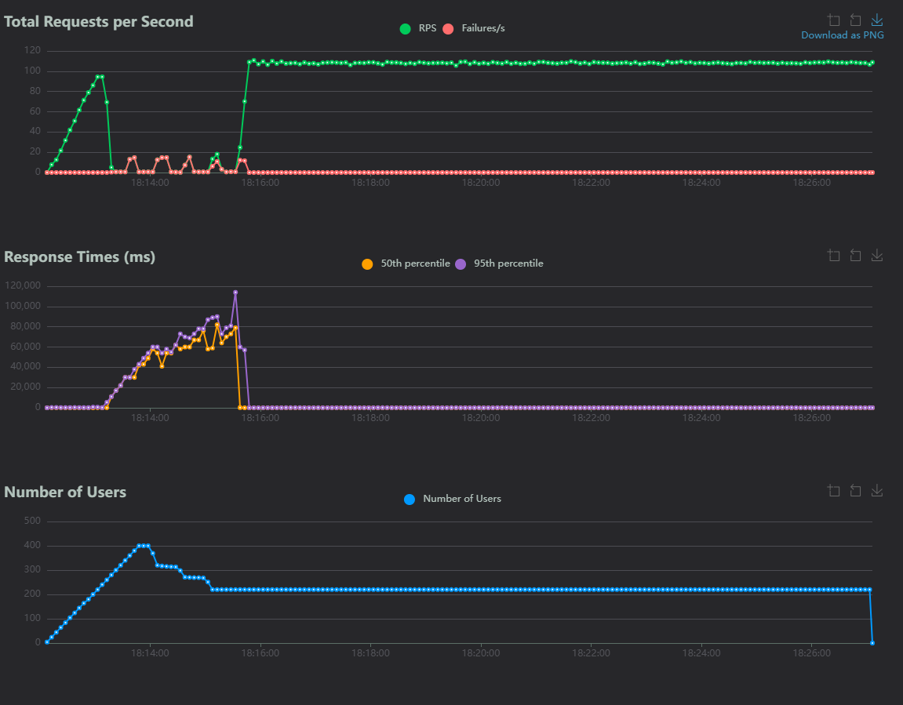

# Load Testing: PostgreSQL vs SQLite

## Methodology

I conducted these tests to make a more informed decision regarding my migration from SQLite to PostgreSQL. While I was aware PostgreSQL is the primary choice for production systems, I wanted to test and understand exactly why SQLite doesn't hold up at scale and where it breaks down.

- For **Locust**, I used a `wait_time` between 1.9s and 2.1s, to simulate real user behaviour. I had the users hit the POST endpoints and GET /{note_id} endpoints at a 3:7 ratio, (favouring reads over writes). The following tests reference the `/POST` endpoint performance, as this was consistently the heavier of the two endpoints. `/GET` endpoint values are indicated in the aggregate p99 section:
```py
Aggregated p99 = (GET_p99 * 0.7) + (POST_p99 * 0.3) 
```
- For all tests, including PostgreSQL's, I kept a consistent rampup of 4 users per second.
- All tests below were run for **15 minutes**, and the data was reset 5 minutes in, with the exception of the WAL test at 400 users (see caveats below).

- Results can be found in the [reports](./reports/) folder. Note that for any HTML files, GitHub may show only the source code, so you may need to download them to view them.

### Hardware Specs

**Model:** MSI Modern 15 H
**OS:** Windows 11 (x64)
**CPU:** 13th Gen Intel Core (~2.1 GHz)
**RAM:** 16 GB Total Physical Memory
**Storage:** Local NVMe SSD

### Limitations

While the hardware and test configurations were kept identical between tests, it is crucial to note that these tests are intended to be viewed relative to one another. There are several limitations that separate this from a true production environment's load tests.
- Locust, the application backend, and the databases were run simultaneously on the same host machine. While this can introduce resource contention, spot-checks via Task Manager during high-load runs confirmed that CPU utilization never reached 100%. This indicates that the performance degradation was likely a database/software ceiling rather than raw hardware exhaustion.
- All tests below were run for **15 minutes**, and the data was reset after 5 minutes in. This is done to avoid spikes in latency as a result of server/database startup when taking on initial users. However, no tests were performed for extensive amounts of time, like a real server would observe.
- All traffic ran over `localhost` and communicated with the same computer. This eliminated real-world network variables such as routing overhead. While this isolated the software and architectural limits of the databases, it resulted in artificially lower tail latencies than a cloud deployed version of the app would observe.

## SQLite

- For the SQLite tests below, the following configurations were used for SQLite and SQLAlchemy. The only values modified consistenyl are the `pool_size` and `max_overflow` parameters, which will be presented in this document as '**`pool_size`+`overflow_allowed` pool**', uvicorn workers, or for the WAL tests, the SQLite PRAGMA is modified to switch to WAL mode:

```python
engine = create_engine(
    DB_URL,
    pool_size=..., # Value modified
    max_overflow=..., # Value modified
    pool_timeout=30,
)

# sqlite, no wal
@event.listens_for(engine, "connect")
def set_sqlite_pragma(dbapi_connection, connection_record):

    dbapi_connection.isolation_level = None

    cursor = dbapi_connection.cursor()
    cursor.execute("PRAGMA synchronous=NORMAL;")
    cursor.execute("PRAGMA busy_timeout=5000;")
    cursor.close()

@event.listens_for(engine, "begin")
def do_begin_immediate(conn):
    conn.execute(text("BEGIN IMMEDIATE"))
```
- `PRAGMA synchronous=NORMAL` differs from its default `FULL` mode. In `FULL` mode, safety is prioritised, as it confirms that the data is successfully written to the disk at every step. While this helps ensure the persistence of data in unexpected events, switching to `NORMAL` provides a significant performance improvement, as it synchronises data less frequently.
- `PRAGMA busy_timeout=5000` tells SQLite how long to wait for a database lock to clear before failing. In this case, if a connection attempts to write while another is writing to the database, it will pause and retry for 5 seconds before throwing its own `database is locked` error.
- `BEGIN IMMEDIATE` is necessary to ensure each write wouldn't cause friction in SQLite's default `BEGIN DEFERRED` mode, where transactions are assumed to be reads until the first INSERT/UPDATE is called.

### SQLite ( WAL mode OFF, 1 worker )

| Config | Duration | Total Requests | Failures | POST p50 | POST p95 | POST p99 | Aggregated p99 ( with GET) |
| :--- | :--- | :--- | :--- | :--- | :--- | :--- | :--- |
| 80 pool (60+20) | 9m 28s | 27,810 | 0 | 43ms | 250ms | 720ms | 650ms |
| 5+0 pool | 10 min | 29,245 | 0 | 38ms | 180ms | 330ms | 300ms |
| 1 pool | 9m 22s | 27,644 | 0 | 28ms | 70ms | 170ms | 140ms |

Average RPS: ~49

#### Key takeaways

- For SQLite, writes are all serialised. However, with WAL mode off, readers are also unable to read while writing takes place. Adding more connections in the pool only adds additional overhead with no additional throughput.
- A larger pool forces threads to wait for the exclusive database lock, escalating p99 latency from 170ms to 720ms and risking database lock errors. Because writes block reads, a single connection pool delivers the best performance by preventing concurrent connections from stalling behind an active writer.

### SQLite ( WAL mode ON )

For WAL configurations, the configuration is as above, with WAL mode added to the SQLite PRAGMA. Here, uvicorn workers are changed alongside the pool configurations.
```python
cursor.execute("PRAGMA journal_mode=WAL;")
```


| Config | Duration | Requests | Failures | POST p50 | POST p95 | POST p99 | Aggregated p99 |
| :--- | :--- | :--- | :--- | :--- | :--- | :--- | :--- |
| 1 worker, 60+20 pool | 10 min | 29,380 | 1* | 26ms | 120ms | 220ms | 220ms |
| 1 worker, 5 pool | 10 min | 29,494 | 0 | 21ms | 89ms | 180ms | 170ms |
| 4 workers, 15+5 pool | 10 min | 29,374 | 0 | 24ms | 98ms | 200ms | 180ms |
| 4 workers, 1 pool | 10 min | 29,644 | 0 | 21ms | 61ms | 96ms | 92ms |

*JWT expiry, token expired at end, excluded

#### Key takeaways
- As seen before, SQLite serialises writes, preventing readers from reading concurrently by default. WAL mode completely unblocks readers, allowing concurrent reads to execute during active write transactions. This structural change entirely eliminates database lock timeouts and failures at this level.
- Despite eliminating errors, oversized connection pools still introduce severe execution overhead without improving throughput. Because writes remain serialised, minimizing pool sizes prevents thread contention at the database engine level, keeping tail latencies low and optimizing resource utilization.
- 4 workers allow dedicated CPU cores to process their single database connections without the queueing seen with a single worker.

## PostgreSQL

- For PostgreSQL testing below, no additional session configurations were set. Similar to SQLite tests, the connection pool parameters and uvicorn workers are the primary things changed in tests. 
- The `pool_pre_ping = True` parameter was also enabled for PostgreSQL to prevent the tests from suffering from anomalous Docker hiccups. For any unexpectedly dropped connections, the pre-ping flags the dead socket, and SQLAlchemy is able to regenerate it before the application layer recieves it. This was omitted for SQLite because the local file database cannot experience network socket failures, and adding it to SQLite would only artificially degrade performance with unnecessary pre-ping overhead.
- Additionally, `pool_recycle = 1800` is to close any idle connections after 30 minutes. While this is useful for idle connections over prolonged periods, this was a non-factor in the below tests, as they were run for 10 minutes.

```python
engine = create_async_engine(
    POSTGRES_DB_URL,
    pool_size=..., # Value modified
    max_overflow=..., # Value modified
    pool_timeout=30,
    pool_recycle=1800,
    pool_pre_ping=True,
)
```
- PostgreSQL has a configurable `max_connections` setting, which is set at 100 by default. For these tests, I left it at that, to avoid hardware becoming a limitation. It's important to note that this setting can be changed in production to allow greater throughput, and should be adjusted along with connection pool manager like pgBouncer (which is outside the current scope of this project).
- To decide how many connection pools each test would use, I kept the total pool below `max_connections * 0.8` to replicate how some connections are reserved in industry.

### PostgreSQL ( Pool Comparison )


| Config | Requests | Failures | POST p50 | POST p95 | POST p99 | Agg. p99 | RPS |
| :--- | :--- | :--- | :--- | :--- | :--- | :--- | :--- |
| 1 worker, 60+20 pool | 29,633 | 0 | 20ms | 34ms | 60ms | 45ms | ~49.4 |
| 4 workers, 15+5 pool | 29,726 | 0 | 17ms | 32ms | 46ms | 36ms | ~49.5 |

#### Key takeaways
- PostgreSQL utilises MVCC to allow reads and writes to run in parallel, keeping latency flat even under load. Tail latencies stay low, showing 0 failures across both configurations.
- At this level of concurrency, the pool size made only a small difference.
- PostgreSQL doesn't carry SQLite's pool-oversizing penalty; writes are not serialised, so many connections can effectively be opened at once. The 200–800 user tests below are where PostgreSQL's scaling behavior is put against SQLite's.

### SQLite vs PostgreSQL: Concurrency Scaling ( 200/400/800 users ) 


| Config | Users | Requests | Failures | POST p50 | POST p95 | POST p99 | Agg. p99 | Max | Avg RPS |
| :--- | :--- | :--- | :--- | :--- | :--- | :--- | :--- | :--- | :--- |
| SQLite WAL, 4w/1pool | 200 | 58,951 | 0 | 24ms | 100ms | 180ms | 180ms | 1,218ms | 98.12 |
| SQLite WAL, 4w/1pool¹ | 400 | 4,828 | 44 | 34ms | 410ms | 11,000ms | 1,200ms | 30,235ms | 115.5 |
| SQLite WAL, 4w/1pool² | 400 | 78,845 | 729 | 21ms | 110ms | 860ms | 706ms | 91,000ms | 108.2 |
| Postgres, 4w/20pool | 200 | 59,571 | 0 | 15ms | 22ms | 36ms | 29ms | 195ms | 99.20 |
| Postgres, 4w/20pool | 400 | 119,215 | 0 | 15ms | 23ms | 31ms | 25ms | 194ms | 198.53 |
| Postgres, 4w/20pool | 800 | 235,345 | 0 | 24ms | 150ms | 310ms | 280ms | 2,525ms | 392.48 |

#### Caveats

##### SQLite, WAL, 400 users

¹Reached a peak concurrency of only 284 users before failing to allow a login. The test was cut short and only lasted 1m 38s due to the crash. The Avg RPS in this row represents the peak RPS achieved right before the API had its `/login` endpoint first fail.  

²The same test, redone for a duration of 15 minutes. In this test, failed users were exited via Locust's `StopUser()` exception, to prevent them from diluting metrics with fast-failing `401 Unauthorized` errors. Out of 400 login attempts, 180 of them failed, giving the `/login` endpoint a failure rate of ~45%. While the first 4 minutes of the run had spiked latencies as users were being added, the remaining ~11 minutes had a steady RPS around 105, consistent with the 200 user population test above. The charts indicate the storm-like increase of tail latencies during login. The aggregated p99 value does not include `/login` endpoints to keep it consistent with other tests.



#### Key takeaways
- PostgreSQL consistently delivers stable and low‑latency performance under increasing concurrency, while SQLite, despite performing well at lower user counts and benefiting from WAL mode's ability to support concurrent reads, hits an unavoidable ceiling due to its serialized write architecture.
- SQLite can match Postgres in p50 latency at small scales, but its tail latencies, write‑lock contention, and inability to sustain high concurrent logins cause severe degradation beyond ~200 users. 
- PostgreSQL scales linearly across 200–800 users with zero failures, predictable tail behavior, and significantly higher throughput, making it far better than SQLite for my use case.

## Conclusion

- SQLite performs well at small scales and can hit fast latencies with WAL mode, making it a good choice for lightweight or low-traffic apps, specifically those that are not write-heavy. It's designed to have serialised writes, not concurrent ones, so its latency will fall apart under high write concurrency beyond ~200 users (given a 7:3 read:write every 2s)
- PostgreSQL is designed for concurrency with its MVCC, allowing both concurrent reads and writes, and so can scale better under concurrency, even to 800 users. In production systems, free from local hardware constraints and optimized for enterprise workloads, it delivers stable throughput and likely scales further reliably.
